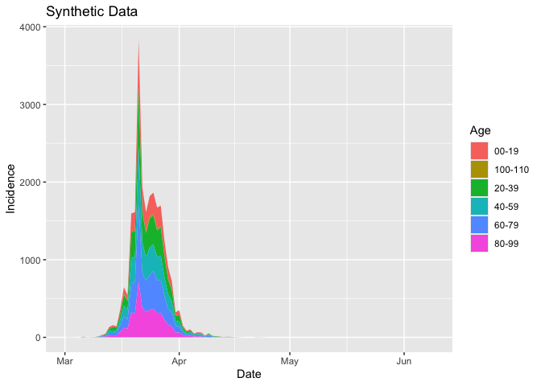
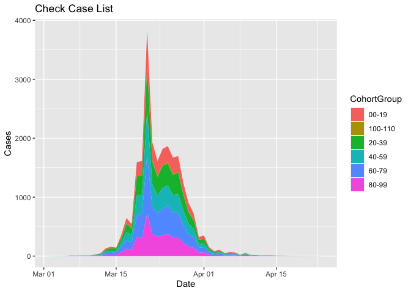

Showing how to generate cases and staff numbers
================

The first step (after installing the package) is to load the library
`epicaser` and the `tidyverse`

``` r
library(epicaser)
library(tidyverse)
```

Use the function `generate_epi_cases()` to generate synthetic data for
cases. Here we use the negative binomial distribution.

``` r
cases <- generate_epi_cases(Poisson = FALSE,rep_fraction = .3)
```

    ## Calling generate_epi_cases to run SIR model and generate data...

``` r
cases
```

    ## # A tibble: 101 × 7
    ##      Day Date        Model Cases AvailableStaff Model_Available_Staff
    ##    <int> <date>      <dbl> <dbl>          <dbl>                 <dbl>
    ##  1     1 2025-03-01  0         0           1161                 1176 
    ##  2     2 2025-03-02  0.374     0           1155                 1158.
    ##  3     3 2025-03-03  0.608     2           1098                 1143.
    ##  4     4 2025-03-04  0.988     1           1112                 1131.
    ##  5     5 2025-03-05  1.60      2           1110                 1120.
    ##  6     6 2025-03-06  2.60      1           1072                 1112.
    ##  7     7 2025-03-07  4.23      1           1065                 1105.
    ##  8     8 2025-03-08  6.87      5           1100                 1099.
    ##  9     9 2025-03-09 11.1      16           1124                 1094.
    ## 10    10 2025-03-10 18.1       8           1134                 1089.
    ## # ℹ 91 more rows
    ## # ℹ 1 more variable: Model_Unavailable_Staff <dbl>

Plot the cases

<!-- -->

Next, we stratify these results into age cohorts, using the default
(this can be changed).

    ## Calling generate_cohort_epi_cases to stratify incidence by age cohort...
    ##  Groups  00-19*20-39*40-59*60-79*80-99*100-110 
    ##  Probs  0.15*0.2*0.2*0.25*0.19*0.01

    ## # A tibble: 101 × 9
    ##    Date       Index Input `00-19` `20-39` `40-59` `60-79` `80-99` `100-110`
    ##    <date>     <int> <dbl>   <dbl>   <dbl>   <dbl>   <dbl>   <dbl>     <dbl>
    ##  1 2025-03-01     1     0       0       0       0       0       0         0
    ##  2 2025-03-02     2     0       0       0       0       0       0         0
    ##  3 2025-03-03     3     2       0       1       1       0       0         0
    ##  4 2025-03-04     4     1       0       0       0       0       0         1
    ##  5 2025-03-05     5     2       1       1       0       0       0         0
    ##  6 2025-03-06     6     1       1       0       0       0       0         0
    ##  7 2025-03-07     7     1       0       0       0       0       0         1
    ##  8 2025-03-08     8     5       1       1       1       1       1         0
    ##  9 2025-03-09     9    16       2       3       5       4       1         1
    ## 10 2025-03-10    10     8       1       3       2       0       2         0
    ## # ℹ 91 more rows

We can display these stratified cohorts in the following chart

<!-- -->

Now, we generate a case list. This generates outputs showing the
progress as synthetic data is created for each individual.

    ## Calling generate_epi_case_list create an individual case list...
    ##  Processing Day number  3 Number of cases generated 1 ...
    ##  Processing Day number  3 Number of cases generated 2 ...
    ##  Processing Day number  4 Number of cases generated 3 ...
    ##  Processing Day number  5 Number of cases generated 4 ...
    ##  Processing Day number  5 Number of cases generated 5 ...
    ##  Processing Day number  6 Number of cases generated 6 ...
    ##  Processing Day number  7 Number of cases generated 7 ...
    ##  Processing Day number  8 Number of cases generated 8 ...
    ##  Processing Day number  8 Number of cases generated 9 ...
    ##  Processing Day number  8 Number of cases generated 10 ...
    ##  Processing Day number  8 Number of cases generated 11 ...
    ##  Processing Day number  8 Number of cases generated 12 ...
    ##  Processing Day number  9 Number of cases generated 13 ...
    ##  Processing Day number  9 Number of cases generated 15 ...
    ##  Processing Day number  9 Number of cases generated 18 ...
    ##  Processing Day number  9 Number of cases generated 23 ...
    ##  Processing Day number  9 Number of cases generated 27 ...
    ##  Processing Day number  9 Number of cases generated 28 ...
    ##  Processing Day number  10 Number of cases generated 29 ...
    ##  Processing Day number  10 Number of cases generated 30 ...
    ##  Processing Day number  10 Number of cases generated 33 ...
    ##  Processing Day number  10 Number of cases generated 35 ...
    ##  Processing Day number  11 Number of cases generated 37 ...
    ##  Processing Day number  11 Number of cases generated 41 ...
    ##  Processing Day number  11 Number of cases generated 45 ...
    ##  Processing Day number  11 Number of cases generated 51 ...
    ##  Processing Day number  11 Number of cases generated 59 ...
    ##  Processing Day number  11 Number of cases generated 68 ...
    ##  Processing Day number  12 Number of cases generated 69 ...
    ##  Processing Day number  12 Number of cases generated 74 ...
    ##  Processing Day number  12 Number of cases generated 82 ...
    ##  Processing Day number  12 Number of cases generated 88 ...
    ##  Processing Day number  12 Number of cases generated 93 ...
    ##  Processing Day number  12 Number of cases generated 100 ...
    ##  Processing Day number  13 Number of cases generated 101 ...
    ##  Processing Day number  13 Number of cases generated 115 ...
    ##  Processing Day number  13 Number of cases generated 135 ...
    ##  Processing Day number  13 Number of cases generated 151 ...
    ##  Processing Day number  13 Number of cases generated 173 ...
    ##  Processing Day number  14 Number of cases generated 191 ...
    ##  Processing Day number  14 Number of cases generated 202 ...
    ##  Processing Day number  14 Number of cases generated 229 ...
    ##  Processing Day number  14 Number of cases generated 257 ...
    ##  Processing Day number  14 Number of cases generated 277 ...
    ##  Processing Day number  14 Number of cases generated 301 ...
    ##  Processing Day number  15 Number of cases generated 303 ...
    ##  Processing Day number  15 Number of cases generated 328 ...
    ##  Processing Day number  15 Number of cases generated 372 ...
    ##  Processing Day number  15 Number of cases generated 412 ...
    ##  Processing Day number  15 Number of cases generated 453 ...
    ##  Processing Day number  15 Number of cases generated 490 ...
    ##  Processing Day number  16 Number of cases generated 495 ...
    ##  Processing Day number  16 Number of cases generated 560 ...
    ##  Processing Day number  16 Number of cases generated 647 ...
    ##  Processing Day number  16 Number of cases generated 715 ...
    ##  Processing Day number  16 Number of cases generated 821 ...
    ##  Processing Day number  16 Number of cases generated 892 ...
    ##  Processing Day number  17 Number of cases generated 895 ...
    ##  Processing Day number  17 Number of cases generated 952 ...
    ##  Processing Day number  17 Number of cases generated 1030 ...
    ##  Processing Day number  17 Number of cases generated 1102 ...
    ##  Processing Day number  17 Number of cases generated 1199 ...
    ##  Processing Day number  17 Number of cases generated 1283 ...
    ##  Processing Day number  18 Number of cases generated 1286 ...
    ##  Processing Day number  18 Number of cases generated 1373 ...
    ##  Processing Day number  18 Number of cases generated 1493 ...
    ##  Processing Day number  18 Number of cases generated 1594 ...
    ##  Processing Day number  18 Number of cases generated 1750 ...
    ##  Processing Day number  18 Number of cases generated 1854 ...
    ##  Processing Day number  19 Number of cases generated 1862 ...
    ##  Processing Day number  19 Number of cases generated 2013 ...
    ##  Processing Day number  19 Number of cases generated 2226 ...
    ##  Processing Day number  19 Number of cases generated 2447 ...
    ##  Processing Day number  19 Number of cases generated 2724 ...
    ##  Processing Day number  19 Number of cases generated 2924 ...
    ##  Processing Day number  20 Number of cases generated 2937 ...
    ##  Processing Day number  20 Number of cases generated 3143 ...
    ##  Processing Day number  20 Number of cases generated 3438 ...
    ##  Processing Day number  20 Number of cases generated 3748 ...
    ##  Processing Day number  20 Number of cases generated 4117 ...
    ##  Processing Day number  20 Number of cases generated 4386 ...
    ##  Processing Day number  21 Number of cases generated 4403 ...
    ##  Processing Day number  21 Number of cases generated 4662 ...
    ##  Processing Day number  21 Number of cases generated 5000 ...
    ##  Processing Day number  21 Number of cases generated 5344 ...
    ##  Processing Day number  21 Number of cases generated 5721 ...
    ##  Processing Day number  21 Number of cases generated 6054 ...
    ##  Processing Day number  22 Number of cases generated 6073 ...
    ##  Processing Day number  22 Number of cases generated 6475 ...
    ##  Processing Day number  22 Number of cases generated 7023 ...
    ##  Processing Day number  22 Number of cases generated 7570 ...
    ##  Processing Day number  22 Number of cases generated 8222 ...
    ##  Processing Day number  22 Number of cases generated 8775 ...
    ##  Processing Day number  23 Number of cases generated 8807 ...
    ##  Processing Day number  23 Number of cases generated 9081 ...
    ##  Processing Day number  23 Number of cases generated 9464 ...
    ##  Processing Day number  23 Number of cases generated 9824 ...
    ##  Processing Day number  23 Number of cases generated 10296 ...
    ##  Processing Day number  23 Number of cases generated 10660 ...
    ##  Processing Day number  24 Number of cases generated 10678 ...
    ##  Processing Day number  24 Number of cases generated 11190 ...
    ##  Processing Day number  24 Number of cases generated 11875 ...
    ##  Processing Day number  24 Number of cases generated 12565 ...
    ##  Processing Day number  24 Number of cases generated 13396 ...
    ##  Processing Day number  24 Number of cases generated 14046 ...
    ##  Processing Day number  25 Number of cases generated 14076 ...
    ##  Processing Day number  25 Number of cases generated 14460 ...
    ##  Processing Day number  25 Number of cases generated 14929 ...
    ##  Processing Day number  25 Number of cases generated 15378 ...
    ##  Processing Day number  25 Number of cases generated 15961 ...
    ##  Processing Day number  25 Number of cases generated 16397 ...
    ##  Processing Day number  26 Number of cases generated 16419 ...
    ##  Processing Day number  26 Number of cases generated 16799 ...
    ##  Processing Day number  26 Number of cases generated 17300 ...
    ##  Processing Day number  26 Number of cases generated 17758 ...
    ##  Processing Day number  26 Number of cases generated 18351 ...
    ##  Processing Day number  26 Number of cases generated 18834 ...
    ##  Processing Day number  27 Number of cases generated 18871 ...
    ##  Processing Day number  27 Number of cases generated 19022 ...
    ##  Processing Day number  27 Number of cases generated 19254 ...
    ##  Processing Day number  27 Number of cases generated 19487 ...
    ##  Processing Day number  27 Number of cases generated 19767 ...
    ##  Processing Day number  27 Number of cases generated 19967 ...
    ##  Processing Day number  28 Number of cases generated 19979 ...
    ##  Processing Day number  28 Number of cases generated 20058 ...
    ##  Processing Day number  28 Number of cases generated 20184 ...
    ##  Processing Day number  28 Number of cases generated 20289 ...
    ##  Processing Day number  28 Number of cases generated 20434 ...
    ##  Processing Day number  28 Number of cases generated 20546 ...
    ##  Processing Day number  29 Number of cases generated 20557 ...
    ##  Processing Day number  29 Number of cases generated 20620 ...
    ##  Processing Day number  29 Number of cases generated 20701 ...
    ##  Processing Day number  29 Number of cases generated 20774 ...
    ##  Processing Day number  29 Number of cases generated 20871 ...
    ##  Processing Day number  29 Number of cases generated 20949 ...
    ##  Processing Day number  30 Number of cases generated 20951 ...
    ##  Processing Day number  30 Number of cases generated 21024 ...
    ##  Processing Day number  30 Number of cases generated 21133 ...
    ##  Processing Day number  30 Number of cases generated 21228 ...
    ##  Processing Day number  30 Number of cases generated 21353 ...
    ##  Processing Day number  30 Number of cases generated 21440 ...
    ##  Processing Day number  31 Number of cases generated 21448 ...
    ##  Processing Day number  31 Number of cases generated 21497 ...
    ##  Processing Day number  31 Number of cases generated 21561 ...
    ##  Processing Day number  31 Number of cases generated 21610 ...
    ##  Processing Day number  31 Number of cases generated 21690 ...
    ##  Processing Day number  31 Number of cases generated 21751 ...
    ##  Processing Day number  32 Number of cases generated 21755 ...
    ##  Processing Day number  32 Number of cases generated 21794 ...
    ##  Processing Day number  32 Number of cases generated 21862 ...
    ##  Processing Day number  32 Number of cases generated 21920 ...
    ##  Processing Day number  32 Number of cases generated 22002 ...
    ##  Processing Day number  32 Number of cases generated 22044 ...
    ##  Processing Day number  33 Number of cases generated 22045 ...
    ##  Processing Day number  33 Number of cases generated 22067 ...
    ##  Processing Day number  33 Number of cases generated 22101 ...
    ##  Processing Day number  33 Number of cases generated 22145 ...
    ##  Processing Day number  33 Number of cases generated 22183 ...
    ##  Processing Day number  34 Number of cases generated 22218 ...
    ##  Processing Day number  34 Number of cases generated 22236 ...
    ##  Processing Day number  34 Number of cases generated 22261 ...
    ##  Processing Day number  34 Number of cases generated 22283 ...
    ##  Processing Day number  34 Number of cases generated 22318 ...
    ##  Processing Day number  34 Number of cases generated 22343 ...
    ##  Processing Day number  35 Number of cases generated 22345 ...
    ##  Processing Day number  35 Number of cases generated 22353 ...
    ##  Processing Day number  35 Number of cases generated 22363 ...
    ##  Processing Day number  35 Number of cases generated 22375 ...
    ##  Processing Day number  35 Number of cases generated 22386 ...
    ##  Processing Day number  36 Number of cases generated 22395 ...
    ##  Processing Day number  36 Number of cases generated 22406 ...
    ##  Processing Day number  36 Number of cases generated 22420 ...
    ##  Processing Day number  36 Number of cases generated 22439 ...
    ##  Processing Day number  36 Number of cases generated 22458 ...
    ##  Processing Day number  36 Number of cases generated 22480 ...
    ##  Processing Day number  37 Number of cases generated 22481 ...
    ##  Processing Day number  37 Number of cases generated 22488 ...
    ##  Processing Day number  37 Number of cases generated 22496 ...
    ##  Processing Day number  37 Number of cases generated 22508 ...
    ##  Processing Day number  37 Number of cases generated 22531 ...
    ##  Processing Day number  38 Number of cases generated 22537 ...
    ##  Processing Day number  38 Number of cases generated 22544 ...
    ##  Processing Day number  38 Number of cases generated 22555 ...
    ##  Processing Day number  38 Number of cases generated 22566 ...
    ##  Processing Day number  38 Number of cases generated 22573 ...
    ##  Processing Day number  39 Number of cases generated 22582 ...
    ##  Processing Day number  39 Number of cases generated 22586 ...
    ##  Processing Day number  39 Number of cases generated 22594 ...
    ##  Processing Day number  39 Number of cases generated 22598 ...
    ##  Processing Day number  39 Number of cases generated 22604 ...
    ##  Processing Day number  39 Number of cases generated 22610 ...
    ##  Processing Day number  40 Number of cases generated 22611 ...
    ##  Processing Day number  40 Number of cases generated 22617 ...
    ##  Processing Day number  40 Number of cases generated 22621 ...
    ##  Processing Day number  40 Number of cases generated 22623 ...
    ##  Processing Day number  40 Number of cases generated 22627 ...
    ##  Processing Day number  41 Number of cases generated 22630 ...
    ##  Processing Day number  41 Number of cases generated 22631 ...
    ##  Processing Day number  41 Number of cases generated 22636 ...
    ##  Processing Day number  41 Number of cases generated 22639 ...
    ##  Processing Day number  41 Number of cases generated 22642 ...
    ##  Processing Day number  42 Number of cases generated 22647 ...
    ##  Processing Day number  42 Number of cases generated 22651 ...
    ##  Processing Day number  42 Number of cases generated 22653 ...
    ##  Processing Day number  42 Number of cases generated 22654 ...
    ##  Processing Day number  42 Number of cases generated 22656 ...
    ##  Processing Day number  43 Number of cases generated 22658 ...
    ##  Processing Day number  43 Number of cases generated 22659 ...
    ##  Processing Day number  43 Number of cases generated 22662 ...
    ##  Processing Day number  43 Number of cases generated 22663 ...
    ##  Processing Day number  44 Number of cases generated 22664 ...
    ##  Processing Day number  44 Number of cases generated 22666 ...
    ##  Processing Day number  44 Number of cases generated 22670 ...
    ##  Processing Day number  44 Number of cases generated 22672 ...
    ##  Processing Day number  44 Number of cases generated 22674 ...
    ##  Processing Day number  45 Number of cases generated 22678 ...
    ##  Processing Day number  46 Number of cases generated 22679 ...
    ##  Processing Day number  46 Number of cases generated 22682 ...
    ##  Processing Day number  46 Number of cases generated 22687 ...
    ##  Processing Day number  47 Number of cases generated 22688 ...
    ##  Processing Day number  47 Number of cases generated 22689 ...
    ##  Processing Day number  47 Number of cases generated 22690 ...
    ##  Processing Day number  47 Number of cases generated 22691 ...
    ##  Processing Day number  48 Number of cases generated 22692 ...
    ##  Processing Day number  49 Number of cases generated 22693 ...
    ##  Processing Day number  50 Number of cases generated 22694 ...
    ##  Processing Day number  51 Number of cases generated 22695 ...
    ##  Processing Day number  54 Number of cases generated 22696 ...

    ## Joining with `by = join_by(Index)`

    ## # A tibble: 22,696 × 4
    ##    Date       CaseID   Age CohortGroup
    ##    <date>      <dbl> <int> <chr>      
    ##  1 2025-03-03      1    34 20-39      
    ##  2 2025-03-03      2    42 40-59      
    ##  3 2025-03-04      3   107 100-110    
    ##  4 2025-03-05      4     0 00-19      
    ##  5 2025-03-05      5    25 20-39      
    ##  6 2025-03-06      6    16 00-19      
    ##  7 2025-03-07      7   103 100-110    
    ##  8 2025-03-08      8     3 00-19      
    ##  9 2025-03-08      9    20 20-39      
    ## 10 2025-03-08     10    46 40-59      
    ## # ℹ 22,686 more rows

We can double-check the summaries to ensure they match the aggregated
values. We can see that two 80-99 year olds were infected on the 5th,
and this tallies with teh early age cohort stratification.

    ## `summarise()` has grouped output by 'Date'. You can override using the
    ## `.groups` argument.

    ## # A tibble: 228 × 3
    ## # Groups:   Date [50]
    ##    Date       CohortGroup Cases
    ##    <date>     <chr>       <int>
    ##  1 2025-03-03 20-39           1
    ##  2 2025-03-03 40-59           1
    ##  3 2025-03-04 100-110         1
    ##  4 2025-03-05 00-19           1
    ##  5 2025-03-05 20-39           1
    ##  6 2025-03-06 00-19           1
    ##  7 2025-03-07 100-110         1
    ##  8 2025-03-08 00-19           1
    ##  9 2025-03-08 20-39           1
    ## 10 2025-03-08 40-59           1
    ## # ℹ 218 more rows

These summaries are plotted.

<!-- -->

Finally, we generate the hospital synthetic data.

    ## Calling generate_hospitalisation_data to generate synthetic hospital records...
    ## Hospital Risk information
    ##  Age Lower  0*30*70 
    ##  Age Upper  30*70*111 
    ##  Hospitalisation Risks  0.01*0.05*0.15 
    ## Hospital LOS
    ##  Age Lower  0*30*70 
    ##  Age Upper  30*70*111 
    ##  Mean LOS  5*10*20 
    ##  SD LOS  1*2*5 
    ## Processing Updates...
    ##   Processing EPI case 1 ...
    ##   Processing EPI case 2500 ...
    ##   Processing EPI case 5000 ...
    ##   Processing EPI case 7500 ...
    ##   Processing EPI case 10000 ...
    ##   Processing EPI case 12500 ...
    ##   Processing EPI case 15000 ...
    ##   Processing EPI case 17500 ...
    ##   Processing EPI case 20000 ...
    ##   Processing EPI case 22500 ...
    ## Completed hospital data generation...
    ## Epi Cases=  22696 Hospital Cases =  1647 Prop =  0.073

    ## # A tibble: 1,647 × 13
    ## # Rowwise: 
    ##    CaseID Source   Destination DateAdmitted DateDischarged   Age Gender
    ##     <dbl> <chr>    <chr>       <date>       <date>         <int> <chr> 
    ##  1     55 Hospital Home        2025-03-17   2025-03-25        78 M     
    ##  2     59 Home     Home        2025-03-19   2025-04-09        82 F     
    ##  3     60 Home     Home        2025-03-19   2025-04-08        91 M     
    ##  4     64 Hospital Home        2025-03-15   2025-04-01        81 F     
    ##  5     66 Home     Hospital    2025-03-11   2025-03-16        88 F     
    ##  6     94 Other    Home        2025-03-16   2025-04-06        96 M     
    ##  7    163 Home     Home        2025-03-23   2025-04-17        78 M     
    ##  8    187 Home     Home        2025-03-19   2025-04-09        80 M     
    ##  9    224 Other    Home        2025-03-19   2025-03-27        38 F     
    ## 10    229 Home     Hospital    2025-03-18   2025-03-29        57 F     
    ## # ℹ 1,637 more rows
    ## # ℹ 6 more variables: DateTestedPositive <date>, CohortGroup <chr>,
    ## #   HRisk <dbl>, Hospitalised <lgl>, TimeToAdmit <int>, TimeInHospital <int>

We can then generate summaries and show the admissions and dishcarges on
one chart

    ## `summarise()` has grouped output by 'DateAdmitted'. You can override using the
    ## `.groups` argument.
    ## `summarise()` has grouped output by 'DateDischarged'. You can override using
    ## the `.groups` argument.

<!-- -->

A version can also be generated in Dutch.

    ## Calling generate_hospitalisation_data to generate synthetic hospital records...
    ## Hospital Risk information
    ##  Age Lower  0*30*70 
    ##  Age Upper  30*70*111 
    ##  Hospitalisation Risks  0.01*0.05*0.15 
    ## Hospital LOS
    ##  Age Lower  0*30*70 
    ##  Age Upper  30*70*111 
    ##  Mean LOS  5*10*20 
    ##  SD LOS  1*2*5 
    ## Processing Updates...
    ##   Processing EPI case 1 ...
    ##   Processing EPI case 2500 ...
    ##   Processing EPI case 5000 ...
    ##   Processing EPI case 7500 ...
    ##   Processing EPI case 10000 ...
    ##   Processing EPI case 12500 ...
    ##   Processing EPI case 15000 ...
    ##   Processing EPI case 17500 ...
    ##   Processing EPI case 20000 ...
    ##   Processing EPI case 22500 ...
    ## Completed hospital data generation...
    ## Epi Cases=  22696 Hospital Cases =  1657 Prop =  0.073

    ## # A tibble: 1,657 × 13
    ## # Rowwise: 
    ##    Opname Herkomst Bestemming startdatumtijd einddatumtijd Leeftijd geslacht
    ##     <dbl> <chr>    <chr>      <date>         <date>           <int> <chr>   
    ##  1     10 Home     Home       2025-03-11     2025-03-22          46 M       
    ##  2     66 Home     Hospital   2025-03-16     2025-03-27          88 M       
    ##  3     83 Hospital Home       2025-03-17     2025-03-24          56 M       
    ##  4     88 Home     Home       2025-03-20     2025-04-08          78 M       
    ##  5     94 Home     Home       2025-03-19     2025-04-18          96 F       
    ##  6    128 Home     Home       2025-03-15     2025-03-23          31 F       
    ##  7    138 Home     Home       2025-03-18     2025-03-29          58 M       
    ##  8    151 Home     Home       2025-03-22     2025-03-30          68 M       
    ##  9    152 Home     Home       2025-03-18     2025-04-02          65 F       
    ## 10    170 Home     Hospital   2025-03-19     2025-04-12          74 M       
    ## # ℹ 1,647 more rows
    ## # ℹ 6 more variables: DateTestedPositive <date>, CohortGroup <chr>,
    ## #   HRisk <dbl>, Hospitalised <lgl>, TimeToAdmit <int>, TimeInHospital <int>
