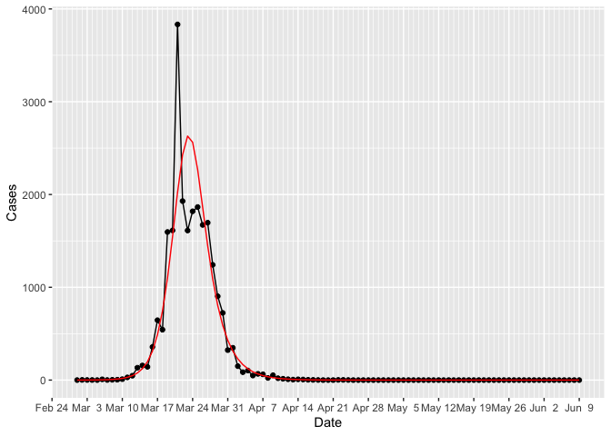

Showing how to generate cases and staff numbers
================

The first step (after installing the package) is to load the library
`epicaser` and the `tidyverse`

``` r
library(epicaser)
library(tidyverse)
```

Use the function `generate_epi_cases()` to generate synthetic data for
cases. Here we use the negative binomial distribution.

``` r
cases <- generate_epi_cases(Poisson = FALSE,rep_fraction = .3)
```

    ## Calling generate_epi_cases to run SIR model and generate data...

``` r
cases
```

    ## # A tibble: 101 × 7
    ##      Day Date        Model Cases AvailableStaff Model_Available_Staff
    ##    <int> <date>      <dbl> <dbl>          <dbl>                 <dbl>
    ##  1     1 2025-03-01  0         0           1155                 1176 
    ##  2     2 2025-03-02  0.374     2           1151                 1158.
    ##  3     3 2025-03-03  0.608     1           1180                 1143.
    ##  4     4 2025-03-04  0.988     1           1162                 1131.
    ##  5     5 2025-03-05  1.60      0           1103                 1120.
    ##  6     6 2025-03-06  2.60      8           1127                 1112.
    ##  7     7 2025-03-07  4.23      1           1113                 1105.
    ##  8     8 2025-03-08  6.87      3           1105                 1099.
    ##  9     9 2025-03-09 11.1       4           1112                 1094.
    ## 10    10 2025-03-10 18.1      10           1076                 1089.
    ## # ℹ 91 more rows
    ## # ℹ 1 more variable: Model_Unavailable_Staff <dbl>

Plot the cases

<!-- -->

Next, we stratify these results into age cohorts, using the default
(this can be changed).

    ## Calling generate_cohort_epi_cases to stratify incidence by age cohort...
    ##  Groups  00-19*20-39*40-59*60-79*80-99*100-110 
    ##  Probs  0.15*0.2*0.2*0.25*0.19*0.01

    ## # A tibble: 101 × 9
    ##    Date       Index Input `00-19` `20-39` `40-59` `60-79` `80-99` `100-110`
    ##    <date>     <int> <dbl>   <dbl>   <dbl>   <dbl>   <dbl>   <dbl>     <dbl>
    ##  1 2025-03-01     1     0       0       0       0       0       0         0
    ##  2 2025-03-02     2     2       0       1       1       0       0         0
    ##  3 2025-03-03     3     1       0       0       0       1       0         0
    ##  4 2025-03-04     4     1       0       0       0       1       0         0
    ##  5 2025-03-05     5     0       0       0       0       0       0         0
    ##  6 2025-03-06     6     8       1       2       0       3       2         0
    ##  7 2025-03-07     7     1       0       0       0       1       0         0
    ##  8 2025-03-08     8     3       1       0       2       0       0         0
    ##  9 2025-03-09     9     4       1       0       0       3       0         0
    ## 10 2025-03-10    10    10       1       3       2       3       1         0
    ## # ℹ 91 more rows

We can display these stratified cohorts in the following chart

<!-- -->

Now, we generate an epi case list. This generates outputs showing the
progress as synthetic data is created for each individual. It shows the
date when each individual was infected (effectively it is an epi line
list, with no contact tracing information).

    ## Calling generate_epi_case_list create an individual case list...
    ##  Processing Day number  2 Number of cases generated 1 ...
    ##  Processing Day number  2 Number of cases generated 2 ...
    ##  Processing Day number  3 Number of cases generated 3 ...
    ##  Processing Day number  4 Number of cases generated 4 ...
    ##  Processing Day number  6 Number of cases generated 5 ...
    ##  Processing Day number  6 Number of cases generated 6 ...
    ##  Processing Day number  6 Number of cases generated 8 ...
    ##  Processing Day number  6 Number of cases generated 11 ...
    ##  Processing Day number  7 Number of cases generated 13 ...
    ##  Processing Day number  8 Number of cases generated 14 ...
    ##  Processing Day number  8 Number of cases generated 15 ...
    ##  Processing Day number  9 Number of cases generated 17 ...
    ##  Processing Day number  9 Number of cases generated 18 ...
    ##  Processing Day number  10 Number of cases generated 21 ...
    ##  Processing Day number  10 Number of cases generated 22 ...
    ##  Processing Day number  10 Number of cases generated 25 ...
    ##  Processing Day number  10 Number of cases generated 27 ...
    ##  Processing Day number  10 Number of cases generated 30 ...
    ##  Processing Day number  11 Number of cases generated 31 ...
    ##  Processing Day number  11 Number of cases generated 36 ...
    ##  Processing Day number  11 Number of cases generated 40 ...
    ##  Processing Day number  11 Number of cases generated 46 ...
    ##  Processing Day number  11 Number of cases generated 52 ...
    ##  Processing Day number  12 Number of cases generated 60 ...
    ##  Processing Day number  12 Number of cases generated 67 ...
    ##  Processing Day number  12 Number of cases generated 78 ...
    ##  Processing Day number  12 Number of cases generated 89 ...
    ##  Processing Day number  12 Number of cases generated 98 ...
    ##  Processing Day number  12 Number of cases generated 106 ...
    ##  Processing Day number  13 Number of cases generated 107 ...
    ##  Processing Day number  13 Number of cases generated 130 ...
    ##  Processing Day number  13 Number of cases generated 154 ...
    ##  Processing Day number  13 Number of cases generated 182 ...
    ##  Processing Day number  13 Number of cases generated 216 ...
    ##  Processing Day number  13 Number of cases generated 239 ...
    ##  Processing Day number  14 Number of cases generated 240 ...
    ##  Processing Day number  14 Number of cases generated 263 ...
    ##  Processing Day number  14 Number of cases generated 308 ...
    ##  Processing Day number  14 Number of cases generated 341 ...
    ##  Processing Day number  14 Number of cases generated 371 ...
    ##  Processing Day number  15 Number of cases generated 397 ...
    ##  Processing Day number  15 Number of cases generated 413 ...
    ##  Processing Day number  15 Number of cases generated 450 ...
    ##  Processing Day number  15 Number of cases generated 470 ...
    ##  Processing Day number  15 Number of cases generated 516 ...
    ##  Processing Day number  15 Number of cases generated 539 ...
    ##  Processing Day number  16 Number of cases generated 540 ...
    ##  Processing Day number  16 Number of cases generated 602 ...
    ##  Processing Day number  16 Number of cases generated 665 ...
    ##  Processing Day number  16 Number of cases generated 740 ...
    ##  Processing Day number  16 Number of cases generated 826 ...
    ##  Processing Day number  16 Number of cases generated 896 ...
    ##  Processing Day number  17 Number of cases generated 897 ...
    ##  Processing Day number  17 Number of cases generated 985 ...
    ##  Processing Day number  17 Number of cases generated 1128 ...
    ##  Processing Day number  17 Number of cases generated 1264 ...
    ##  Processing Day number  17 Number of cases generated 1411 ...
    ##  Processing Day number  17 Number of cases generated 1534 ...
    ##  Processing Day number  18 Number of cases generated 1542 ...
    ##  Processing Day number  18 Number of cases generated 1611 ...
    ##  Processing Day number  18 Number of cases generated 1724 ...
    ##  Processing Day number  18 Number of cases generated 1850 ...
    ##  Processing Day number  18 Number of cases generated 1970 ...
    ##  Processing Day number  18 Number of cases generated 2082 ...
    ##  Processing Day number  19 Number of cases generated 2085 ...
    ##  Processing Day number  19 Number of cases generated 2307 ...
    ##  Processing Day number  19 Number of cases generated 2641 ...
    ##  Processing Day number  19 Number of cases generated 2977 ...
    ##  Processing Day number  19 Number of cases generated 3340 ...
    ##  Processing Day number  19 Number of cases generated 3663 ...
    ##  Processing Day number  20 Number of cases generated 3681 ...
    ##  Processing Day number  20 Number of cases generated 3922 ...
    ##  Processing Day number  20 Number of cases generated 4249 ...
    ##  Processing Day number  20 Number of cases generated 4573 ...
    ##  Processing Day number  20 Number of cases generated 4984 ...
    ##  Processing Day number  20 Number of cases generated 5287 ...
    ##  Processing Day number  21 Number of cases generated 5294 ...
    ##  Processing Day number  21 Number of cases generated 5896 ...
    ##  Processing Day number  21 Number of cases generated 6629 ...
    ##  Processing Day number  21 Number of cases generated 7388 ...
    ##  Processing Day number  21 Number of cases generated 8377 ...
    ##  Processing Day number  21 Number of cases generated 9094 ...
    ##  Processing Day number  22 Number of cases generated 9127 ...
    ##  Processing Day number  22 Number of cases generated 9438 ...
    ##  Processing Day number  22 Number of cases generated 9821 ...
    ##  Processing Day number  22 Number of cases generated 10215 ...
    ##  Processing Day number  22 Number of cases generated 10665 ...
    ##  Processing Day number  22 Number of cases generated 11043 ...
    ##  Processing Day number  23 Number of cases generated 11056 ...
    ##  Processing Day number  23 Number of cases generated 11311 ...
    ##  Processing Day number  23 Number of cases generated 11625 ...
    ##  Processing Day number  23 Number of cases generated 11923 ...
    ##  Processing Day number  23 Number of cases generated 12326 ...
    ##  Processing Day number  23 Number of cases generated 12653 ...
    ##  Processing Day number  24 Number of cases generated 12668 ...
    ##  Processing Day number  24 Number of cases generated 12936 ...
    ##  Processing Day number  24 Number of cases generated 13308 ...
    ##  Processing Day number  24 Number of cases generated 13669 ...
    ##  Processing Day number  24 Number of cases generated 14115 ...
    ##  Processing Day number  24 Number of cases generated 14468 ...
    ##  Processing Day number  25 Number of cases generated 14487 ...
    ##  Processing Day number  25 Number of cases generated 14762 ...
    ##  Processing Day number  25 Number of cases generated 15135 ...
    ##  Processing Day number  25 Number of cases generated 15471 ...
    ##  Processing Day number  25 Number of cases generated 15964 ...
    ##  Processing Day number  25 Number of cases generated 16333 ...
    ##  Processing Day number  26 Number of cases generated 16352 ...
    ##  Processing Day number  26 Number of cases generated 16628 ...
    ##  Processing Day number  26 Number of cases generated 16967 ...
    ##  Processing Day number  26 Number of cases generated 17270 ...
    ##  Processing Day number  26 Number of cases generated 17688 ...
    ##  Processing Day number  26 Number of cases generated 18003 ...
    ##  Processing Day number  27 Number of cases generated 18024 ...
    ##  Processing Day number  27 Number of cases generated 18292 ...
    ##  Processing Day number  27 Number of cases generated 18659 ...
    ##  Processing Day number  27 Number of cases generated 18979 ...
    ##  Processing Day number  27 Number of cases generated 19395 ...
    ##  Processing Day number  27 Number of cases generated 19710 ...
    ##  Processing Day number  28 Number of cases generated 19720 ...
    ##  Processing Day number  28 Number of cases generated 19908 ...
    ##  Processing Day number  28 Number of cases generated 20176 ...
    ##  Processing Day number  28 Number of cases generated 20416 ...
    ##  Processing Day number  28 Number of cases generated 20725 ...
    ##  Processing Day number  28 Number of cases generated 20950 ...
    ##  Processing Day number  29 Number of cases generated 20962 ...
    ##  Processing Day number  29 Number of cases generated 21110 ...
    ##  Processing Day number  29 Number of cases generated 21298 ...
    ##  Processing Day number  29 Number of cases generated 21489 ...
    ##  Processing Day number  29 Number of cases generated 21688 ...
    ##  Processing Day number  29 Number of cases generated 21853 ...
    ##  Processing Day number  30 Number of cases generated 21865 ...
    ##  Processing Day number  30 Number of cases generated 21973 ...
    ##  Processing Day number  30 Number of cases generated 22122 ...
    ##  Processing Day number  30 Number of cases generated 22258 ...
    ##  Processing Day number  30 Number of cases generated 22444 ...
    ##  Processing Day number  30 Number of cases generated 22583 ...
    ##  Processing Day number  31 Number of cases generated 22589 ...
    ##  Processing Day number  31 Number of cases generated 22635 ...
    ##  Processing Day number  31 Number of cases generated 22696 ...
    ##  Processing Day number  31 Number of cases generated 22761 ...
    ##  Processing Day number  31 Number of cases generated 22850 ...
    ##  Processing Day number  31 Number of cases generated 22910 ...
    ##  Processing Day number  32 Number of cases generated 22912 ...
    ##  Processing Day number  32 Number of cases generated 22969 ...
    ##  Processing Day number  32 Number of cases generated 23054 ...
    ##  Processing Day number  32 Number of cases generated 23119 ...
    ##  Processing Day number  32 Number of cases generated 23196 ...
    ##  Processing Day number  32 Number of cases generated 23259 ...
    ##  Processing Day number  33 Number of cases generated 23260 ...
    ##  Processing Day number  33 Number of cases generated 23284 ...
    ##  Processing Day number  33 Number of cases generated 23313 ...
    ##  Processing Day number  33 Number of cases generated 23341 ...
    ##  Processing Day number  33 Number of cases generated 23377 ...
    ##  Processing Day number  33 Number of cases generated 23407 ...
    ##  Processing Day number  34 Number of cases generated 23410 ...
    ##  Processing Day number  34 Number of cases generated 23420 ...
    ##  Processing Day number  34 Number of cases generated 23442 ...
    ##  Processing Day number  34 Number of cases generated 23460 ...
    ##  Processing Day number  34 Number of cases generated 23476 ...
    ##  Processing Day number  34 Number of cases generated 23492 ...
    ##  Processing Day number  35 Number of cases generated 23495 ...
    ##  Processing Day number  35 Number of cases generated 23511 ...
    ##  Processing Day number  35 Number of cases generated 23532 ...
    ##  Processing Day number  35 Number of cases generated 23548 ...
    ##  Processing Day number  35 Number of cases generated 23577 ...
    ##  Processing Day number  36 Number of cases generated 23598 ...
    ##  Processing Day number  36 Number of cases generated 23604 ...
    ##  Processing Day number  36 Number of cases generated 23614 ...
    ##  Processing Day number  36 Number of cases generated 23627 ...
    ##  Processing Day number  36 Number of cases generated 23637 ...
    ##  Processing Day number  37 Number of cases generated 23647 ...
    ##  Processing Day number  37 Number of cases generated 23657 ...
    ##  Processing Day number  37 Number of cases generated 23662 ...
    ##  Processing Day number  37 Number of cases generated 23684 ...
    ##  Processing Day number  37 Number of cases generated 23700 ...
    ##  Processing Day number  38 Number of cases generated 23714 ...
    ##  Processing Day number  38 Number of cases generated 23728 ...
    ##  Processing Day number  38 Number of cases generated 23737 ...
    ##  Processing Day number  38 Number of cases generated 23747 ...
    ##  Processing Day number  38 Number of cases generated 23765 ...
    ##  Processing Day number  38 Number of cases generated 23775 ...
    ##  Processing Day number  39 Number of cases generated 23776 ...
    ##  Processing Day number  39 Number of cases generated 23780 ...
    ##  Processing Day number  39 Number of cases generated 23784 ...
    ##  Processing Day number  39 Number of cases generated 23789 ...
    ##  Processing Day number  39 Number of cases generated 23795 ...
    ##  Processing Day number  39 Number of cases generated 23798 ...
    ##  Processing Day number  40 Number of cases generated 23799 ...
    ##  Processing Day number  40 Number of cases generated 23805 ...
    ##  Processing Day number  40 Number of cases generated 23818 ...
    ##  Processing Day number  40 Number of cases generated 23828 ...
    ##  Processing Day number  40 Number of cases generated 23846 ...
    ##  Processing Day number  41 Number of cases generated 23851 ...
    ##  Processing Day number  41 Number of cases generated 23853 ...
    ##  Processing Day number  41 Number of cases generated 23857 ...
    ##  Processing Day number  41 Number of cases generated 23860 ...
    ##  Processing Day number  41 Number of cases generated 23865 ...
    ##  Processing Day number  41 Number of cases generated 23870 ...
    ##  Processing Day number  42 Number of cases generated 23871 ...
    ##  Processing Day number  42 Number of cases generated 23873 ...
    ##  Processing Day number  42 Number of cases generated 23880 ...
    ##  Processing Day number  42 Number of cases generated 23883 ...
    ##  Processing Day number  42 Number of cases generated 23884 ...
    ##  Processing Day number  43 Number of cases generated 23885 ...
    ##  Processing Day number  43 Number of cases generated 23886 ...
    ##  Processing Day number  43 Number of cases generated 23888 ...
    ##  Processing Day number  43 Number of cases generated 23889 ...
    ##  Processing Day number  43 Number of cases generated 23891 ...
    ##  Processing Day number  44 Number of cases generated 23894 ...
    ##  Processing Day number  44 Number of cases generated 23897 ...
    ##  Processing Day number  44 Number of cases generated 23898 ...
    ##  Processing Day number  45 Number of cases generated 23899 ...
    ##  Processing Day number  45 Number of cases generated 23900 ...
    ##  Processing Day number  45 Number of cases generated 23904 ...
    ##  Processing Day number  46 Number of cases generated 23907 ...
    ##  Processing Day number  46 Number of cases generated 23908 ...
    ##  Processing Day number  46 Number of cases generated 23910 ...
    ##  Processing Day number  46 Number of cases generated 23911 ...
    ##  Processing Day number  47 Number of cases generated 23913 ...
    ##  Processing Day number  47 Number of cases generated 23915 ...
    ##  Processing Day number  48 Number of cases generated 23916 ...
    ##  Processing Day number  48 Number of cases generated 23917 ...
    ##  Processing Day number  49 Number of cases generated 23918 ...
    ##  Processing Day number  53 Number of cases generated 23919 ...
    ##  Processing Day number  53 Number of cases generated 23920 ...
    ##  Processing Day number  54 Number of cases generated 23921 ...
    ##  Processing Day number  54 Number of cases generated 23922 ...
    ##  Processing Day number  55 Number of cases generated 23923 ...

    ## Joining with `by = join_by(Index)`

    ## # A tibble: 23,923 × 4
    ##    Date       CaseID   Age CohortGroup
    ##    <date>      <dbl> <int> <chr>      
    ##  1 2025-03-02      1    34 20-39      
    ##  2 2025-03-02      2    45 40-59      
    ##  3 2025-03-03      3    65 60-79      
    ##  4 2025-03-04      4    65 60-79      
    ##  5 2025-03-06      5     9 00-19      
    ##  6 2025-03-06      6    26 20-39      
    ##  7 2025-03-06      7    39 20-39      
    ##  8 2025-03-06      8    63 60-79      
    ##  9 2025-03-06      9    63 60-79      
    ## 10 2025-03-06     10    68 60-79      
    ## # ℹ 23,913 more rows

We can double-check the summaries to ensure they match the aggregated
values.

    ## `summarise()` has grouped output by 'Date'. You can override using the
    ## `.groups` argument.

    ## # A tibble: 228 × 3
    ## # Groups:   Date [50]
    ##    Date       CohortGroup Cases
    ##    <date>     <chr>       <int>
    ##  1 2025-03-02 20-39           1
    ##  2 2025-03-02 40-59           1
    ##  3 2025-03-03 60-79           1
    ##  4 2025-03-04 60-79           1
    ##  5 2025-03-06 00-19           1
    ##  6 2025-03-06 20-39           2
    ##  7 2025-03-06 60-79           3
    ##  8 2025-03-06 80-99           2
    ##  9 2025-03-07 60-79           1
    ## 10 2025-03-08 00-19           1
    ## # ℹ 218 more rows

These summaries are plotted.

<!-- -->

Finally, we generate the hospital synthetic data.

    ## Calling generate_hospitalisation_data to generate synthetic hospital records...
    ## Hospital Risk information
    ##  Age Lower  0*30*70 
    ##  Age Upper  30*70*111 
    ##  Hospitalisation Risks  0.01*0.05*0.15 
    ## Hospital LOS
    ##  Age Lower  0*30*70 
    ##  Age Upper  30*70*111 
    ##  Mean LOS  5*10*20 
    ##  SD LOS  1*2*5 
    ## Processing Updates...
    ##   Processing EPI case 1 ...
    ##   Processing EPI case 2500 ...
    ##   Processing EPI case 5000 ...
    ##   Processing EPI case 7500 ...
    ##   Processing EPI case 10000 ...
    ##   Processing EPI case 12500 ...
    ##   Processing EPI case 15000 ...
    ##   Processing EPI case 17500 ...
    ##   Processing EPI case 20000 ...
    ##   Processing EPI case 22500 ...
    ## Completed hospital data generation...
    ## Epi Cases=  23923 Hospital Cases =  1727 Prop =  0.072

    ## # A tibble: 1,727 × 13
    ## # Rowwise: 
    ##    CaseID Source   Destination DateAdmitted DateDischarged   Age Gender
    ##     <dbl> <chr>    <chr>       <date>       <date>         <int> <chr> 
    ##  1     15 Home     Home        2025-03-11   2025-03-19        51 M     
    ##  2     18 Home     Hospital    2025-03-11   2025-04-04        72 M     
    ##  3     20 Home     Death       2025-03-14   2025-04-11        77 M     
    ##  4     29 Hospital Hospital    2025-03-16   2025-04-02        79 F     
    ##  5     48 Home     Home        2025-03-18   2025-03-24        74 F     
    ##  6     57 Home     Home        2025-03-12   2025-04-03        97 F     
    ##  7     88 Hospital Home        2025-03-17   2025-03-25        54 F     
    ##  8    105 Home     Home        2025-03-16   2025-03-30        82 F     
    ##  9    106 Home     Home        2025-03-19   2025-04-05       105 F     
    ## 10    146 Hospital Home        2025-03-18   2025-03-26        33 M     
    ## # ℹ 1,717 more rows
    ## # ℹ 6 more variables: DateTestedPositive <date>, CohortGroup <chr>,
    ## #   HRisk <dbl>, Hospitalised <lgl>, TimeToAdmit <int>, TimeInHospital <int>

We can then generate summaries and show the admissions and dishcarges on
one chart

    ## `summarise()` has grouped output by 'DateAdmitted'. You can override using the
    ## `.groups` argument.
    ## `summarise()` has grouped output by 'DateDischarged'. You can override using
    ## the `.groups` argument.

<!-- -->

A version can also be generated in Dutch.

    ## Calling generate_hospitalisation_data to generate synthetic hospital records...
    ## Hospital Risk information
    ##  Age Lower  0*30*70 
    ##  Age Upper  30*70*111 
    ##  Hospitalisation Risks  0.01*0.05*0.15 
    ## Hospital LOS
    ##  Age Lower  0*30*70 
    ##  Age Upper  30*70*111 
    ##  Mean LOS  5*10*20 
    ##  SD LOS  1*2*5 
    ## Processing Updates...
    ##   Processing EPI case 1 ...
    ##   Processing EPI case 2500 ...
    ##   Processing EPI case 5000 ...
    ##   Processing EPI case 7500 ...
    ##   Processing EPI case 10000 ...
    ##   Processing EPI case 12500 ...
    ##   Processing EPI case 15000 ...
    ##   Processing EPI case 17500 ...
    ##   Processing EPI case 20000 ...
    ##   Processing EPI case 22500 ...
    ## Completed hospital data generation...
    ## Epi Cases=  23923 Hospital Cases =  1737 Prop =  0.073

    ## # A tibble: 1,737 × 13
    ## # Rowwise: 
    ##    Opname Herkomst Bestemming startdatumtijd einddatumtijd Leeftijd geslacht
    ##     <dbl> <chr>    <chr>      <date>         <date>           <int> <chr>   
    ##  1     18 Home     Hospital   2025-03-13     2025-04-05          72 M       
    ##  2     29 Home     Home       2025-03-11     2025-03-29          79 M       
    ##  3     49 Home     Home       2025-03-17     2025-03-31          73 F       
    ##  4     53 Home     Home       2025-03-17     2025-04-14          93 F       
    ##  5     54 Home     Home       2025-03-13     2025-04-12          82 F       
    ##  6     58 Other    Home       2025-03-16     2025-04-17          90 M       
    ##  7     86 Home     Home       2025-03-15     2025-03-26          58 F       
    ##  8     96 Home     Death      2025-03-15     2025-03-28          73 M       
    ##  9     98 Home     Home       2025-03-17     2025-04-11          91 F       
    ## 10    141 Home     Home       2025-03-16     2025-03-27          39 F       
    ## # ℹ 1,727 more rows
    ## # ℹ 6 more variables: DateTestedPositive <date>, CohortGroup <chr>,
    ## #   HRisk <dbl>, Hospitalised <lgl>, TimeToAdmit <int>, TimeInHospital <int>
