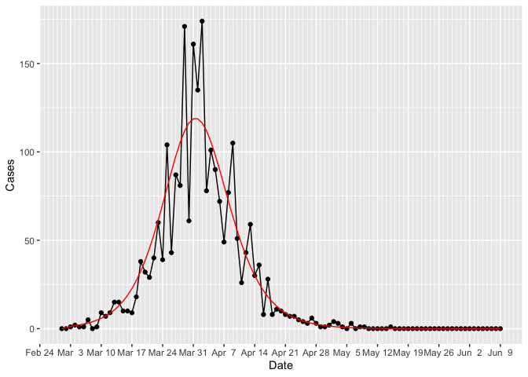
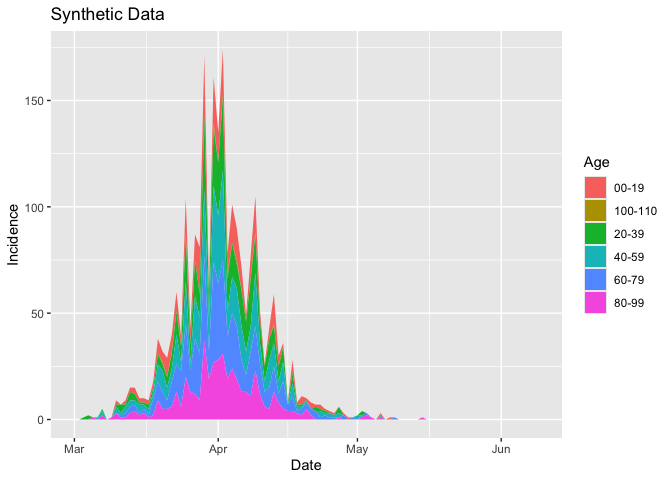
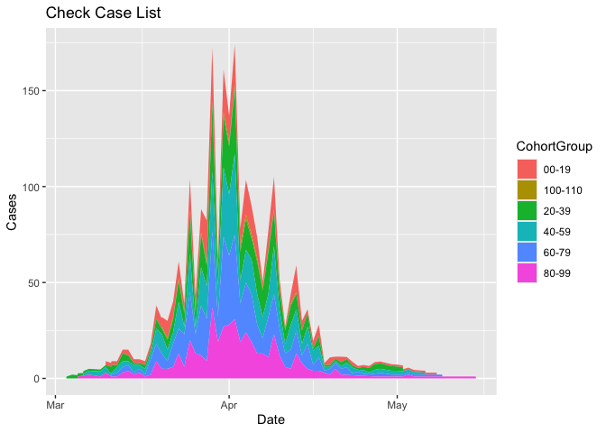

Showing how to generate patient pathway information
================

The first step (after installing the package) is to load the library
`epicaser` and the `tidyverse`

``` r
library(epicaser)
library(tidyverse)
```

Use the function `generate_epi_cases()` to generate synthetic data for
cases. Here we use the negative binomial distribution.

``` r
cases <- generate_epi_cases(Poisson = FALSE,RF = .3,N = 10000,I0 = 10)
```

    ## Calling generate_epi_cases to run SEIR model and generate data...

``` r
cases
```

    ## # A tibble: 101 × 4
    ##      Day Date       Model Cases
    ##    <int> <date>     <dbl> <dbl>
    ##  1     1 2025-03-01 0         0
    ##  2     2 2025-03-02 0.520     0
    ##  3     3 2025-03-03 1.25      1
    ##  4     4 2025-03-04 1.70      2
    ##  5     5 2025-03-05 2.12      1
    ##  6     6 2025-03-06 2.61      1
    ##  7     7 2025-03-07 3.20      5
    ##  8     8 2025-03-08 3.92      0
    ##  9     9 2025-03-09 4.79      1
    ## 10    10 2025-03-10 5.85      9
    ## # ℹ 91 more rows

Plot the cases

<!-- -->

Next, we stratify these results into age cohorts, using the default
(this can be changed).

    ## Calling generate_cohort_epi_cases to stratify incidence by age cohort...
    ##  Groups  00-19*20-39*40-59*60-79*80-99*100-110 
    ##  Probs  0.15*0.2*0.2*0.25*0.19*0.01

    ## # A tibble: 101 × 9
    ##    Date       Index Input `00-19` `20-39` `40-59` `60-79` `80-99` `100-110`
    ##    <date>     <int> <dbl>   <dbl>   <dbl>   <dbl>   <dbl>   <dbl>     <dbl>
    ##  1 2025-03-01     1     0       0       0       0       0       0         0
    ##  2 2025-03-02     2     0       0       0       0       0       0         0
    ##  3 2025-03-03     3     1       0       1       0       0       0         0
    ##  4 2025-03-04     4     2       0       2       0       0       0         0
    ##  5 2025-03-05     5     1       0       0       0       0       1         0
    ##  6 2025-03-06     6     1       0       0       1       0       0         0
    ##  7 2025-03-07     7     5       0       1       2       0       2         0
    ##  8 2025-03-08     8     0       0       0       0       0       0         0
    ##  9 2025-03-09     9     1       0       0       0       0       1         0
    ## 10 2025-03-10    10     9       2       1       3       0       3         0
    ## # ℹ 91 more rows

We can display these stratified cohorts in the following chart

<!-- -->

Now, we generate an epi case list. This generates outputs showing the
progress as synthetic data is created for each individual. It shows the
date when each individual was infected (effectively it is an epi line
list, with no contact tracing information).

    ## Calling generate_epi_case_list create an individual case list...

    ## Joining with `by = join_by(Index)`

    ## # A tibble: 2,311 × 4
    ##    Date       CaseID   Age CohortGroup
    ##    <date>      <dbl> <int> <chr>      
    ##  1 2025-03-03      1    27 20-39      
    ##  2 2025-03-04      2    30 20-39      
    ##  3 2025-03-04      3    38 20-39      
    ##  4 2025-03-05      4    92 80-99      
    ##  5 2025-03-06      5    46 40-59      
    ##  6 2025-03-07      6    38 20-39      
    ##  7 2025-03-07      7    46 40-59      
    ##  8 2025-03-07      8    41 40-59      
    ##  9 2025-03-07      9    97 80-99      
    ## 10 2025-03-07     10    87 80-99      
    ## # ℹ 2,301 more rows

We can double-check the summaries to ensure they match the aggregated
values.

    ## `summarise()` has regrouped the output.
    ## ℹ Summaries were computed grouped by Date and CohortGroup.
    ## ℹ Output is grouped by Date.
    ## ℹ Use `summarise(.groups = "drop_last")` to silence this message.
    ## ℹ Use `summarise(.by = c(Date, CohortGroup))` for per-operation grouping
    ##   (`?dplyr::dplyr_by`) instead.

    ## # A tibble: 265 × 3
    ## # Groups:   Date [66]
    ##    Date       CohortGroup Cases
    ##    <date>     <chr>       <int>
    ##  1 2025-03-03 20-39           1
    ##  2 2025-03-04 20-39           2
    ##  3 2025-03-05 80-99           1
    ##  4 2025-03-06 40-59           1
    ##  5 2025-03-07 20-39           1
    ##  6 2025-03-07 40-59           2
    ##  7 2025-03-07 80-99           2
    ##  8 2025-03-09 80-99           1
    ##  9 2025-03-10 00-19           2
    ## 10 2025-03-10 20-39           1
    ## # ℹ 255 more rows

These summaries are plotted.

<!-- -->

Next we generate the hospital synthetic data. There are two steps.
First, we generate the arrival information.

    ## Calling generate_hospitalisation_data to generate synthetic arrival records...
    ## Hospital Risk information
    ##  Age Lower  0*30*70 
    ##  Age Upper  30*70*111 
    ##  Hospitalisation Risks  0.03*0.08*0.15 
    ## Processing Updates...
    ##   Processing EPI case 1 ...
    ## Completed hospital arrivals generation...
    ## Epi Cases=  2311 Hospital Cases =  205 Prop =  0.089

    ## # A tibble: 205 × 9
    ##    CaseID Source                 DateAdmitted TimeAdmitted          Age Gender
    ##     <dbl> <chr>                  <date>       <dttm>              <int> <chr> 
    ##  1      3 Own living environment 2025-03-13   2025-03-13 09:01:30    38 F     
    ##  2     10 Own living environment 2025-03-15   2025-03-15 17:13:50    87 M     
    ##  3     16 Own living environment 2025-03-16   2025-03-16 18:26:52    57 F     
    ##  4     34 Own living environment 2025-03-17   2025-03-17 10:37:46    76 M     
    ##  5     41 Other facility         2025-03-21   2025-03-21 18:19:50    25 F     
    ##  6     49 Other facility         2025-03-19   2025-03-19 21:35:22    94 F     
    ##  7     66 Own living environment 2025-03-23   2025-03-23 09:59:35    84 F     
    ##  8     74 Other facility         2025-03-21   2025-03-21 08:42:03    61 F     
    ##  9     76 Own living environment 2025-03-22   2025-03-22 21:15:25    83 F     
    ## 10     81 Own living environment 2025-03-25   2025-03-25 09:16:06    53 M     
    ## # ℹ 195 more rows
    ## # ℹ 3 more variables: DateTestedPositive <date>, CohortGroup <chr>, HRisk <dbl>

We can show all the columns for arrivals:

    ## Rows: 205
    ## Columns: 9
    ## $ CaseID             <dbl> 3, 10, 16, 34, 41, 49, 66, 74, 76, 81, 93, 138, 141…
    ## $ Source             <chr> "Own living environment", "Own living environment",…
    ## $ DateAdmitted       <date> 2025-03-13, 2025-03-15, 2025-03-16, 2025-03-17, 20…
    ## $ TimeAdmitted       <dttm> 2025-03-13 09:01:30, 2025-03-15 17:13:50, 2025-03-…
    ## $ Age                <int> 38, 87, 57, 76, 25, 94, 84, 61, 83, 53, 48, 72, 75,…
    ## $ Gender             <chr> "F", "M", "F", "M", "F", "F", "F", "F", "F", "M", "…
    ## $ DateTestedPositive <date> 2025-03-04, 2025-03-07, 2025-03-10, 2025-03-12, 20…
    ## $ CohortGroup        <chr> "20-39", "80-99", "40-59", "60-79", "20-39", "80-99…
    ## $ HRisk              <dbl> 0.08, 0.15, 0.08, 0.15, 0.03, 0.15, 0.15, 0.08, 0.1…

Lastly, we generate the patient pathways. The default function
parameters show how the data is configured.

    ## Calling generate_patient_pathways to build process data for patient journeys...
    ## Hospital Pathway Logic

    ## # A tibble: 479 × 10
    ##    CaseID   Age Gender Pathway_Step Origin       Destination StartTime          
    ##     <dbl> <dbl> <chr>         <dbl> <chr>        <chr>       <dttm>             
    ##  1      3    38 F                 1 Own living … Ward        2025-03-13 09:01:30
    ##  2      3    38 F                 2 Ward         Home        2025-03-13 11:01:30
    ##  3     10    87 M                 1 Own living … Ward        2025-03-15 17:13:50
    ##  4     10    87 M                 2 Ward         ICU         2025-03-15 19:13:50
    ##  5     10    87 M                 3 ICU          Home        2025-03-18 20:13:50
    ##  6     16    57 F                 1 Own living … Ward        2025-03-16 18:26:52
    ##  7     16    57 F                 2 Ward         Home        2025-03-16 20:26:52
    ##  8     34    76 M                 1 Own living … Ward        2025-03-17 10:37:46
    ##  9     34    76 M                 2 Ward         ICU         2025-03-17 12:37:46
    ## 10     34    76 M                 3 ICU          Home        2025-03-20 13:37:46
    ## # ℹ 469 more rows
    ## # ℹ 3 more variables: EndTime <dttm>, DurationDays <dbl>, ICU_Admission <lgl>

We can show all the columns for pathways:

    ## Rows: 479
    ## Columns: 10
    ## $ CaseID        <dbl> 3, 3, 10, 10, 10, 16, 16, 34, 34, 34, 41, 41, 49, 49, 49…
    ## $ Age           <dbl> 38, 38, 87, 87, 87, 57, 57, 76, 76, 76, 25, 25, 94, 94, …
    ## $ Gender        <chr> "F", "F", "M", "M", "M", "F", "F", "M", "M", "M", "F", "…
    ## $ Pathway_Step  <dbl> 1, 2, 1, 2, 3, 1, 2, 1, 2, 3, 1, 2, 1, 2, 3, 1, 2, 1, 2,…
    ## $ Origin        <chr> "Own living environment", "Ward", "Own living environmen…
    ## $ Destination   <chr> "Ward", "Home", "Ward", "ICU", "Home", "Ward", "Home", "…
    ## $ StartTime     <dttm> 2025-03-13 09:01:30, 2025-03-13 11:01:30, 2025-03-15 17…
    ## $ EndTime       <dttm> 2025-03-13 10:01:30, 2025-03-18 11:01:30, 2025-03-15 18…
    ## $ DurationDays  <dbl> 0.04166667, 5.00000000, 0.04166667, 3.00000000, 25.00000…
    ## $ ICU_Admission <lgl> FALSE, FALSE, FALSE, TRUE, FALSE, FALSE, FALSE, FALSE, T…
