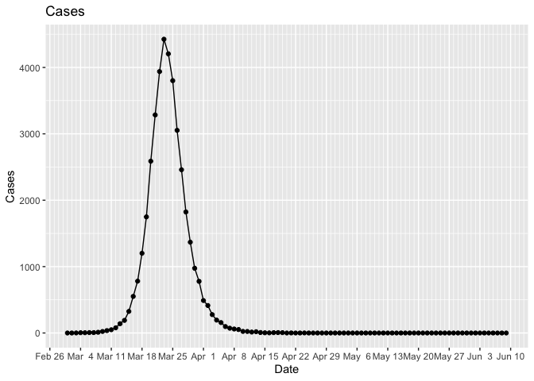
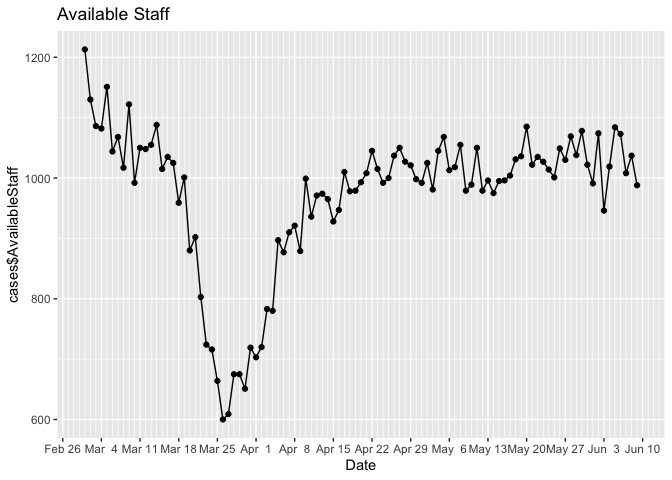

Showing how to generate cases and staff numbers
================

The first step (after installing the package) is to load the library
`epicaser`

``` r
library(epicaser)
library(ggplot2)
library(dplyr)
```

Use the function `generate_epi_cases()` to generate synthetic data, so
that we can test the model.

``` r
cases <- generate_epi_cases(staff_per_100K = 1200,
                               staff_recovery_delay = 6,
                               staff_absenteeism = 0.03)
cases
```

    ## # A tibble: 101 × 7
    ##      Day Date        Model Cases Model_Available_Staff Model_Unavailable_Staff
    ##    <int> <date>      <dbl> <dbl>                 <dbl>                   <dbl>
    ##  1     1 2024-03-01  0         0                 1176                     24  
    ##  2     2 2024-03-02  0.624     3                 1147.                    52.7
    ##  3     3 2024-03-03  1.01      0                 1124.                    76.3
    ##  4     4 2024-03-04  1.65      0                 1104.                    95.6
    ##  5     5 2024-03-05  2.67      2                 1089.                   111. 
    ##  6     6 2024-03-06  4.34      4                 1076.                   124. 
    ##  7     7 2024-03-07  7.05      4                 1065.                   135. 
    ##  8     8 2024-03-08 11.4      13                 1056.                   144. 
    ##  9     9 2024-03-09 18.6      19                 1049.                   151. 
    ## 10    10 2024-03-10 30.1      37                 1042.                   158. 
    ## # ℹ 91 more rows
    ## # ℹ 1 more variable: AvailableStaff <dbl>

Plot the cases

<!-- -->

Plot the staff numbers. These are Poisson random variables with the mean
taken from the ODE model.

    ## Warning: Use of `cases$AvailableStaff` is discouraged.
    ## ℹ Use `AvailableStaff` instead.
    ## Use of `cases$AvailableStaff` is discouraged.
    ## ℹ Use `AvailableStaff` instead.

<!-- -->
